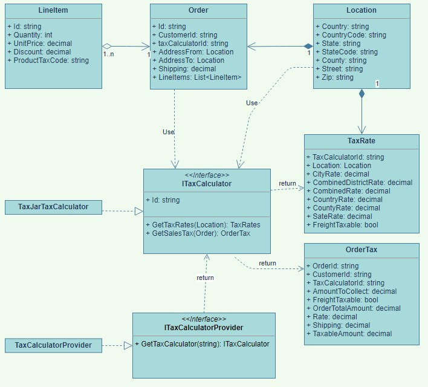

# IMC_di Tax Calculator Sample

## Description

Sales Tax Calculator Web Service using the [TaxJar REST API](https://developers.taxjar.com/api/reference).

## Running Prototype

The sample is running at https://imc-rmb.azurewebsites.net
using a Basic Azure AppService Dev/Test B1 instance (1.75 GB memory and 100 ACU).

For demo purposes the Swagger endpoint is exposed at:

https://imc-rmb.azurewebsites.net/swagger/index.html

**The sample is unsecured!**

To run the project locally is necessary to create a user's secret file and add two settings: TaxJarUrl and TaxJarApiKey. In Azure deployment these values are in the AppService configuration (a KeyVault would be more appropriate).

## Solution Artifacts

|File|Description|
|-|-|
|GetTaxForOrder.json|Order object in json format to facilitate testing with Swagger (included below)|
|IMC.rest|Rest file to test the endpoints using VS Code REST Client extension|
|IMC.ClassDiagram.drawio|Class diagram file generate by Draw.io|
|IMC.ClassDiagram.jpg|Screen capture if class diagram (included below)|

## Testing with Swagger

The following json body can be used for testing the Order tax endpoint:

``` json
{
  "id": "1",
  "customerId": "1",
  "addressTo": {
    "countryCode": "US",
    "zip": "90002",
    "stateCode": "CA",
    "city": "Los Angeles",
    "street": "1335 E 103rd St"
  },
  "addressFrom": {
    "countryCode": "US",
    "zip": "92093",
    "stateCode": "CA",
    "city": "La Jolla",
    "street": "9500 Gilman Drive"
  },
  "shipping": 1.5,
  "lineItems": [
    {
      "id": "abc",
      "quantity": 1,
      "productTaxCode": "20010",
      "unitPrice": 15,
      "discount": 0
    }
  ]
}
```

## Testing with VS Code REST Client

A IMC.rest file is also included in the solution root. This file is intended to work with the [VS Code REST Client](https://marketplace.visualstudio.com/items?itemName=humao.rest-client) extension and provides additional testing capabilities.

## Project Structure

Only the minimal set of Entities as required by the TaxJar REST Api where created. The IMC Domain Entities are totally independent from the TaxJar API opening the possibility of having other Tax Calculators in the future. 

### Main Class Diagram



## Building & Unit Testing

There is a simple build.cake [Cakebuild](https://cakebuild.net/) file included in the root folder. This uses the Cake.Tool locally to drive the execution of the build, testing, and publishing of artifacts via the command line
:    

After cloning the repository Cake.Tool dotnet tool should be restored using:

```
dotnet tool restore
```

Afterwards, the solution can be tested and built using:

``` text
dotnet cake
```

The same Cakebuild script could eventually be also used in a CI/CD build server so that the build runs the same everywhere. 

## Validations

Some rules -by far not all that would be necessary in a production environment- have been imposed on the IMC.Domain and TaxJar entities following the documentation. [FluentValidation](https://www.nuget.org/packages/FluentValidation/) Nuget package was used to create some relatively complex rules. For example requirements for the Zip Code:

``` C#
    string usZipPattern = @"^\d{5}(-\d{4})?$";

    // Enforce Zip required & correct format for US
    RuleFor(l => l.Zip)
        .NotEmpty()
            .WithMessage("Zip code is required.")
        .Matches(usZipPattern)
        .When(l => (l.CountryCode == "US"))
            .WithMessage("Invalid Zip format for US.");


    // Enforce CountryCode for Zip not conforming to US format
    RuleFor(l => l.CountryCode)
        .NotEmpty()
            .When(l => (l.Zip != null) && (!Regex.IsMatch(l.Zip, usZipPattern)))
            .WithMessage("CountryCode is mandatory when zip code not USA ")
        .Length(2)
            .WithMessage("CountryCode must be two characters long");
```


